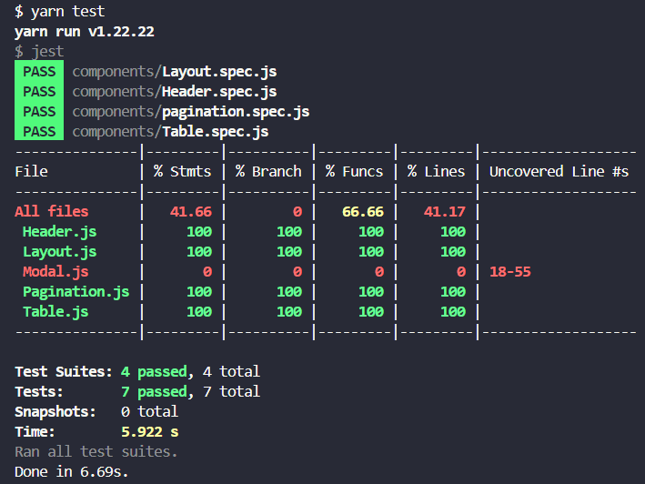
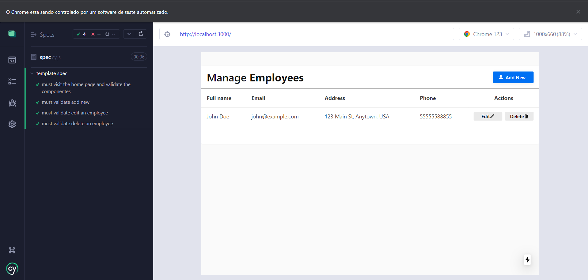

# Table of Content

- [Table of Content](#table-of-content)
  - [1. Folder Structures](#1-folder-structures)
  - [2. Libraries \& Frameworks](#2-libraries--frameworks)
  - [3. Installation \& Set Up](#3-installation--set-up)
  - [4. Running Tests](#4-running-tests)
  - [5. License](#5-license)

## 1. Folder Structures

```bash
+---components
+---cypress
|   \---downloads
|   \---e2e
|   \---fixtures
|   \---support
+---icons
+---images
+---models
+---pages
|   \---api
|       \---employees
+---store
|   +---actions
|   +---reducers
|   \---sagas
+---styles
\---utils
```

## 2. Libraries & Frameworks

| Name                                                         | Description                                                            |
| ------------------------------------------------------------ | ---------------------------------------------------------------------- |
| [NextJS](https://nextjs.org/)                                | The React Framework for Production.                                    |
| [ReactJS](https://reactjs.org/)                              | A JavaScript library for building user interfaces.                     |
| [Redux](https://redux.js.org/)                               | A Predictable State Container for JS Apps.                             |
| [Redux Saga](https://redux-saga.js.org/)                     | A middleware used to handle side effects in Redux.                     |
| [React Hook Form](https://react-hook-form.com/)              | Performant, flexible and extensible forms with easy-to-use validation. |
| [Mongoose](https://mongoosejs.com/)                          | Elegant mongodb object modeling for node.js                            |
| [Jest](https://jestjs.io/)                                   | Delightful JavaScript Testing Framework with a focus on simplicity.     |
| [React Testing Library](https://testing-library.com/react)   | Simple and complete testing utilities that encourage good testing practices. |
| [Cypress](https://www.cypress.io/)                           | Fast, easy and reliable testing for anything that runs in a browser.    |


## 3. Installation & Set Up

1. Install project dependencies

```bash
  yarn install or npm install
```

2. Add environment variables on your `.env.local`

```env
  MONGO_URI=
```

3. Start the development server

```bash
  yarn dev or npm run dev
```

4. Build for production

```bash
  yarn build or npm run build
```

5. Run production mode

```bash
  yarn start or npm start
```

## 4. Running Tests

1. Running jest

```bash
  yarn test
```

2. Visualizing results
   
   

4. Running Cypress

```bash
  yarn cypress:open
```

4. visualizing results



## 5. License

MIT © [Roldan Montilla Jr](https://github.com/roldanjr)
